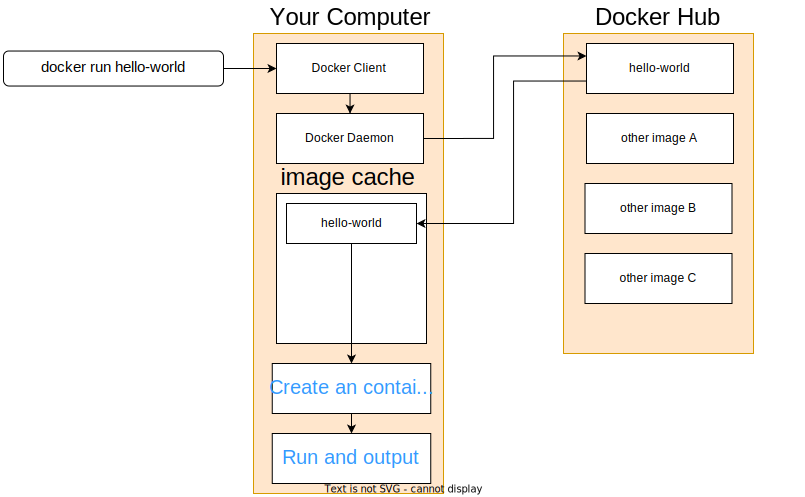
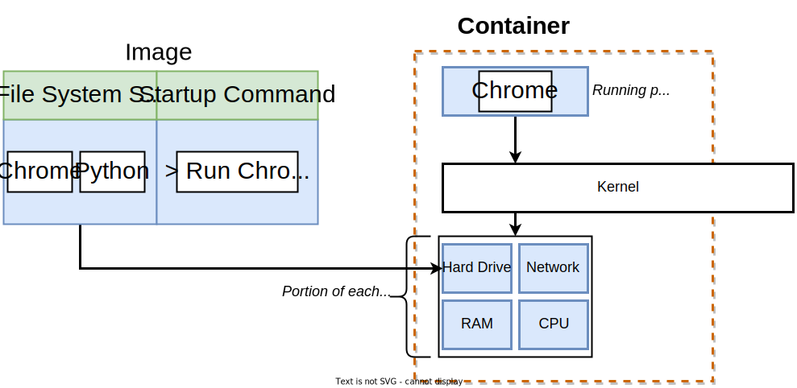

# Docker
```ad-note
**Why use Docker?**
Docker makes it really easy to install and run software without worrying about setup or dependencies.

**What is Docker?**
Docker is a platform or ecosystem around creating and running containers
```
## Install Docker
```ad-info
**Docker Client** (Docker CLI): Tool that we are going to issue commands to
**Docker Server** (Docker Daemon): Tool that is responsible for creating images, running containers, etc
```
Docker Docs: https://docs.docker.com/
### macOS
Go to [docker.com](https://www.docker.com/) sign up an account and download Docker Desktop. 
Run following command to see if it works ok
```bash
~ docker version
```
### Ubuntu
## Using the docker Client
Run this command in your terminal
```bash
~ docker run hello-world
```
And it will return
```bash
Unable to find image 'hello-world:latest' locally
latest: Pulling from library/hello-world
2db29710123e: Pull complete
Digest: sha256:bfea6278a0a267fad2634554f4f0c6f31981eea41c553fdf5a83e95a41d40c38
Status: Downloaded newer image for hello-world:latest

Hello from Docker!
This message shows that your installation appears to be working correctly.
...
```
This example explains the whole process for running this command:
1. The Docker client contacted the Docker daemon.
2. The Docker daemon pulled the "hello-world" image from the Docker Hub.
3. The Docker daemon created a new container from that image which runs the executable that produces the output you are currently reading.
4. The Docker daemon streamed that output to the Docker client, which sent it to your terminal.

```ad-info
An **image** is a single file with everything needed to run one specific program
A **container** is an instance of an image for running a program.
```
### What is a container?
To understand the concept of a container, let's first review how your operating system runs on your computer. 

See the picture below, let's assume that running the program Chrome requires Python. An image is like a snapshot of the file system (FS) required for running Chrome, plus the running command. The running command will call kernel and the kernel will isolate a little section of the hard drive and make it available to just this container. The FS snapshot will be stored into this little segment of the hard drive. So now inside of this very specific grouping of resources, we've got a little section of the hard drive that has just Chrome and Python installed and essentially nothing else. The startup command is then executed and it will start up Chrome. 

To sum up, a container is a running process, along with a subset of physical resources on your computer that are allocated to that process specifically. 

However, these features belong to Linux only. When you install docker on your macOS or Windows systems, you installed a linux virtual machine (VM). This linux kernel is going to be in charge of limiting access or kind of constraining access or isolating access to different hardware resources on your computer. You can actually see this Linux VM in practice by running the command `docker version`. 
```bash
~ docker version
Client:
 Cloud integration: v1.0.22
 Version:           20.10.13
 API version:       1.41
 Go version:        go1.16.15
 Git commit:        a224086
 Built:             Thu Mar 10 14:08:44 2022
 OS/Arch:           darwin/amd64
 Context:           default
 Experimental:      true

Server: Docker Desktop 4.6.1 (76265)
 Engine:
  Version:          20.10.13
  API version:      1.41 (minimum version 1.12)
  Go version:       go1.16.15
  Git commit:       906f57f
  Built:            Thu Mar 10 14:06:05 2022
  OS/Arch:          linux/amd64
  Experimental:     false
 containerd:
  Version:          1.5.10
  GitCommit:        2a1d4dbdb2a1030dc5b01e96fb110a9d9f150ecc
 runc:
  Version:          1.0.3
  GitCommit:        v1.0.3-0-gf46b6ba
 docker-init:
  Version:          0.19.0
  GitCommit:        de40ad0
```
In the output, you will notice that there is a OS/Arch: linux/amd64. 
## Docker run command
`docker run <image name>` will create a container with the given image. And it will run with its default command. It equals to running the command `docker create <image name>` and `docker start <container id>`. Here are some variations of this command. 
### Override default command
Normally, when running a container, it will run its default start up command. You cound run a different command instead, but this command has to be included in the image FS Snapshot mentioned before. 
```bash
docker run <image name> <other-command>
```
example:
```bash
~ docker run busybox echo "hi there"
hi there
```

### List all running containers
If there is any container continuously running, this command will list them all.
```bash
~ docker ps
CONTAINER ID   IMAGE     COMMAND   CREATED          STATUS          PORTS     NAMES
104a93cdab52   ubuntu    "bash"    43 seconds ago   Up 42 seconds             optimistic_hellman
```
To list all containers that we have ever created, run
```bash
~ docker ps --all
CONTAINER ID   IMAGE         COMMAND             CREATED          STATUS                        PORTS     NAMES
104a93cdab52   ubuntu        "bash"              4 minutes ago    Exited (0) 2 minutes ago                optimistic_hellman
a10371e69681   busybox       "echo 'hi there'"   9 minutes ago    Exited (0) 9 minutes ago                kind_payne
c3285fe96560   busybox       "ls"                9 minutes ago    Exited (0) 9 minutes ago                vigorous_shannon
f11d69f3bdf0   ubuntu        "bash ls"           23 minutes ago   Exited (126) 23 minutes ago             elated_yalow
848836eb16c9   ubuntu        "bash"              23 minutes ago   Exited (0) 23 minutes ago               serene_torvalds
85969c04b03f   ubuntu        "bash"              24 minutes ago   Exited (127) 23 minutes ago             objective_feistel
da08a3efafa9   hello-world   "/hello"            25 minutes ago   Exited (0) 25 minutes ago               busy_elgamal
6a669691457d   busybox       "sh"                25 minutes ago   Exited (0) 25 minutes ago               vibrant_goldstine
87c2108981fd   hello-world   "/hello"            25 minutes ago   Exited (0) 25 minutes ago               condescending_chaum
30c19ff9cfa1   hello-world   "ls"                25 minutes ago   Created                                 hardcore_gates
62ebcdfaecb0   hello-world   "/hello"            24 hours ago     Exited (0) 24 hours ago                 affectionate_noether
```

```ad-info
Life cycle of a container

```
