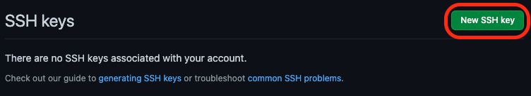

### Git & Github

[TOC]

## 版本控制

版本控制（version control）是一种在开发的过程中用于管理我们对文件、目录或工程等内容的修改历史，方便查看更改历史记录，备份以便恢复以前的版本的软件工程技术。

+ 实现跨区域多人协同开发 
+ 追踪和记载一个或者多个文件的历史记录 
+ 组织和保护你的源代码和文档 
+ 统计工作量 
+ 并行开发、提高开发效率 
+ 跟踪记录整个软件的开发过程 
+ 减轻开发人员的负担，节省时间，同时降低人为错误

简单说就是用于管理多人协同开发项目的技术。

没有进行版本控制或者版本控制本身缺乏正确的流程管理，在软件开发过程中将会引入很多问题，如软件代码的一致性、软件内容的冗余、软件过程的事物性、软件开发过程中的并发性、软件源代码的安全 性，以及软件的整合等问题。

主流的版本控制器有如下这些：

+ **Git** 
+ **SVN**（Subversion） 
+ **CVS**（Concurrent Versions System） 
+ **VSS**（Micorosoft Visual SourceSafe） 
+ **TFS**（Team Foundation Server） 
+ Visual Studio Online

版本控制产品非常的多（Perforce、Rational ClearCase、RCS（GNU Revision Control System）、Serena Dimention、SVK、BitKeeper、Monotone、Bazaar、Mercurial、SourceGear Vault），现在影响力最大且使用最广泛的是Git与SVN

## 版本控制分类

### 本地版本控制

记录文件每次的更新，可以对每个版本做一个快照，或是记录补丁文件，适合个人用，如RCS。


### 集中版本控制

所有的版本数据都保存在服务器上，协同开发者从服务器上同步更新或上传自己的修改


所有的版本数据都存在服务器上，用户的本地只有自己以前所同步的版本，如果不连网的话，用户就看不到历史版本，也无法切换版本验证问题，或在不同分支工作。而且，所有数据都保存在单一的服务器上，有很大的风险这个服务器会损坏，这样就会丢失所有的数据，当然可以定期备份。代表产品：SVN、CVS、VSS

### 分布式版本控制

所有版本信息仓库全部同步到本地的每个用户，这样就可以在本地查看所有版本历史，可以离线在本地提交，只需在连网时push到相应的服务器或其他用户那里。由于每个用户那里保存的都是所有的版本数据，只要有一个用户的设备没有问题就可以恢复所有的数据，但这增加了本地存储空间的占用。


> **Git与SVN最主要区别**
>
> SVN是集中式版本控制系统，版本库是集中放在中央服务器的，而工作的时候，用的都是自己的电脑，所以首先要从中央服务器得到最新的版本，然后工作，完成工作后，需要把自己做完的活推送到中央服务器。集中式版本控制系统是必须联网才能工作，对网络带宽要求较高。
>
> Git是分布式版本控制系统，没有中央服务器，每个人的电脑就是一个完整的版本库，工作的时候不需要联网了，因为版本都在自己电脑上。协同的方法是这样的：比如说自己在电脑上改了文件A，其他人也在电脑上改了文件A，这时，你们两之间只需把各自的修改推送给对方，就可以互相看到对方的修改了。
>
> Git是目前世界上最先进的分布式版本控制系统。

## Git 历史

同生活中的许多伟大事物一样，Git 诞生于一个极富纷争大举创新的年代。 Linux 内核开源项目有着为数众广的参与者。 绝大多数的 Linux 内核维护工作都花在了提交补丁和保存 归档的繁琐事务上(1991－2002年间)。 到 2002 年，整个项目组开始启用一个专有的分布式版本控制系 统 BitKeeper 来管理和维护代码。

到了 2005 年，开发 BitKeeper 的商业公司同 Linux 内核开源社区的合作关系结束，他们收回了 Linux 内核社区免费使用 BitKeeper 的权力。 这就迫使 Linux 开源社区(特别是 Linux 的缔造者 Linus Torvalds)基于使用 BitKeeper 时的经验教训，开发出自己的版本系统。 也就是后来的 Git！

Git是目前世界上最先进的分布式版本控制系统。

Git是免费、开源的，最初Git是为辅助 Linux 内核开发的，来替代 BitKeeper！


<center>Linux和Git之父李纳斯·托沃兹（Linus Benedic Torvalds）1969、芬兰</center>

## Git环境配置

[git官网](https://git-scm.com)

[国内淘宝镜像](http://npm.taobao.org/mirrors)

下载对应版本，无脑安装

查看是否安装成功 `git --version`

## Git 配置

+ 查看配置 `git config -l`
+ 查看不同级别的配置文件：
  + 查看系统config `git config --system --list`
  + 查看当前用户（global）配置 `git config --global --list`


### 用户名与邮箱

当你安装Git后首先要做的事情是设置你的用户名称和e-mail地址。这是非常重要的，因为每次Git提交都 会使用该信息。它被永远的嵌入到了你的提交中：

```sh
git config --global user.name "Zhuqi Xiao" #名称 
git config --global user.email "zqxiao.shawn@qq.com" #邮箱
```

只需要做一次这个设置，如果你传递了`--global` 选项，因为Git将总是会使用该信息来处理你在系统中所做的一切操作。如果你希望在一个特定的项目中使用不同的名称或e-mail地址，你可以在该项目中运行该命令而不要--global选项。 总之`--global`为全局配置，不加为某个项目的特定配置。

## Git 基本理论

### 工作区域 

Git本地有三个工作区域：工作目录（Working Directory）、暂存区(Stage/Index)、资源库(Repository或Git Directory)。如果再加上远程的git仓库(Remote Directory)就可以分为四个工作区域。文件在这四 个区域之间的转换关系如下：


+ 本地工作目录：平时存放项目代码的地方 
+ 暂存区（Index / Stage）：用于临时存放你的改动，事实上它只是一个文件，保存即将提交的文件列表信息 
+ 本地git仓库（Repository）：安全存放数据的位置，这里面有你提交到所有版本的数据。其中HEAD指向最新放入仓库的版本 
+ 远程仓库（Remote）：托管代码的服务器，可以简单的认为是你项目组中的一台电脑用于远程数据交换

本地的三个区域确切的说应该是git仓库中HEAD指向的版本：


+ Directory：使用Git管理的一个目录，也就是一个仓库，包含我们的工作空间和Git的管理空间
+ WorkSpace：需要通过Git进行版本控制的目录和文件，这些目录和文件组成了工作空间。 
+ .git：存放Git管理信息的目录，初始化仓库的时候自动创建。
+  Index/Stage：暂存区，或者叫待提交更新区，在提交进入repo之前，我们可以把所有的更新放在暂存区
+ Local Repo：本地仓库，一个存放在本地的版本库；HEAD会只是当前的开发分支（branch）。
+ Stash：隐藏，是一个工作状态保存栈，用于保存/恢复WorkSpace中的临时状态。

### 工作流程

git的工作流程一般是这样的：

1. 在工作目录中添加、修改文件；
2. 将需要进行版本管理的文件放入暂存区域；
3. 将暂存区域的文件提交到git仓库。

因此，git管理的文件有三种状态：已修改（modified），已暂存（staged），已提交(committed)

## Git 项目搭建

### 创建工作目录与常用指令

工作目录（WorkSpace)一般就是你希望Git帮助你管理的文件夹，可以是你项目的目录，也可以是一个 空目录，**建议不要有中文**。

日常使用只要记住下图6个命令：


### 本地仓库搭建

创建本地仓库的方法有两种：一种是创建全新的仓库，另一种是克隆远程仓库。

1、创建全新的仓库，需要用GIT管理的项目的根目录执行：

```sh
# 在当前目录新建一个Git代码库 
git init
```

2、执行后可以看到，仅仅在项目目录多出了一个`.git`目录，关于版本等的所有信息都在这个目录里面。

### 克隆远程仓库

1、另一种方式是克隆远程目录，由于是将远程服务器上的仓库完全镜像一份至本地！

```sh
# 克隆一个项目和它的整个代码历史(版本信息) 
git clone [url]
```

2、去 gitee 或者 github 上克隆一个测试！

## GIT文件操作

### 文件4种状态

版本控制就是对文件的版本控制，要对文件进行修改、提交等操作，首先要知道文件当前在什么状态，不然可能会提交了现在还不想提交的文件，或者要提交的文件没提交上。

+ **Untracked**: 未跟踪， 此文件在文件夹中， 但并没有加入到git库， 不参与版本控制
  + 通过`git add`状态变为 `Staged `
+ **Unmodify**: 文件已经入库， 未修改， 即版本库中的文件快照内容与文件夹中完全一致
  + 如果它被修改， 而变为Modified
  + 如果使用 `git rm`移出版本库， 则成为Untracked文件
+ **Modified**: 文件已修改， 仅仅是修改， 并没有进行其他的操作 
  +  通过`git add`可进入暂存 staged 状态
  + 使用 `git checkout `则丢弃修改过， 返回到 unmodify 状态， 这个` git checkout` 即从库中取出文件， 覆盖当前修改 !
+ **Staged**: 暂存状态
  + 执行 `git commit` 则将修改同步到库中， 这时库中的文件和本地文件又变为一致， 文件为 Unmodify 状态
  + 执行 `git reset HEAD filename `取消暂存， 文件状态为Modified

### 查看文件状态

上面说文件有4种状态，通过如下命令可以查看到文件的状态：

```sh
#查看指定文件状态 
git status [filename]

#查看所有文件状态 
git status
```

### 忽略文件

有些时候我们不想把某些文件纳入版本控制中，比如数据库文件，临时文件，设计文件等

在主目录下建立".gitignore"文件，此文件有如下规则：

1. 忽略文件中的空行或以井号（#）开始的行将会被忽略。

2. 可以使用Linux通配符。例如：星号（*）代表任意多个字符，问号（？）代表一个字符，方括号 （[abc]）代表可选字符范围，大括号（{string1,string2,...}）代表可选的字符串等。

3. 如果名称的最前面有一个感叹号（!），表示例外规则，将不被忽略。

4. 如果名称的最前面是一个路径分隔符（/），表示要忽略的文件在此目录下，而子目录中的文件不 忽略。

5. 如果名称的最后面是一个路径分隔符（/），表示要忽略的是此目录下该名称的子目录，而非文件 （默认文件或目录都忽略）。

```sh
# 为注释 
*.txt						#忽略所有 .txt结尾的文件
!lib.txt 				#但lib.txt除外 
/temp 					#仅忽略项目根目录下的TODO文件,不包括其它目录temp 
build/ 					#忽略build/目录下的所有文件 
doc/*.txt				#会忽略 doc/notes.txt 但不包括 doc/server/arch.txt
```

## Git分之 Branch

分支在GIT中相对较难，分支就是科幻电影里面的平行宇宙，如果两个平行宇宙互不干扰，那对现在的你 也没啥影响。不过，在某个时间点，两个平行宇宙合并了，我们就需要处理一些问题了！


git分支中常用指令：

```sh
# 列出所有本地分支 
git branch

# 列出所有远程分支 
git branch -r

# 新建一个分支，但依然停留在当前分支 
git branch [branch-name]

# 新建一个分支，并切换到该分支 
git checkout -b [branch]

# 合并指定分支到当前分支 
git merge [branch]

# 删除分支
git branch -d [branch-name]

# 删除远程分支
git push origin --delete [branch-name]
git branch -dr [remote/branch]
```

多个分支如果并行执行，就会导致我们代码不冲突，也就是同时存在多个版本！

如果同一个文件在合并分支时都被修改了则会引起冲突：解决的办法是我们可以修改冲突文件后重新提 交！如果了冲突了就需要协商即可

master主分支应该非常稳定，用来发布新版本，一般情况下不允许在上面工作，工作一般情况下在新建 的dev分支上工作，工作完后，比如上要发布，或者说dev分支代码稳定后可以合并到主分支master上

来。

## GitHub配置（macOS）

打开终端

```sh
ssh-keygen -t rsa -C "github_account_id"
```

之后的问题可以直接回车略过


ssh文件创建成功后

```sh
open ~/.ssh
```

弹出文件夹，找到并使用文本文件打开`id_rsa.pub`


接下来，打开[GitHub](https://github.com/)网站并登陆，右上角点击头像，选Settings，接下来左边栏找到SSH and GPG keys


接下来，点击SSH Keys右边的New SSH Key




点Add SSH key后，这里会出现新加的SSH


接下来，在本地终端中测试GitHub是否已连接

```sh
ssh -T git@github.com
```

出先以下提示

```txt
The authenticity of host 'github.com (192.30.255.113)' can't be established.
Are you sure you want to continue connecting (yes/no)? yes
```

输入yes后，会显示出以下代码(表示成功了)

```txt
Hi xxxx! You've successfully authenticated, but GitHub does not provide shell access.
```

## 案例

+ 在测试文件夹中打开terminal
+ `git init` 在当前文件夹内初始化git环境
+ 随便创建一个文件例如 hello.txt
+ `git add .` 将当前目录下所有文件添加到暂存区
+ `git commit -m "message"`提交到本地仓库
+ 本地git版本库push到github
  + 第一次的话，需要`git remote add origin git@github.com:xxx/xxxx.git`
  + 以后可以直接`git push -u origin master`

## Git 学习网站

+ [码云Git大全](https://gitee.com/all-about-git)
+ [菜鸟教程Git教程](https://www.runoob.com/git/git-tutorial.html)

