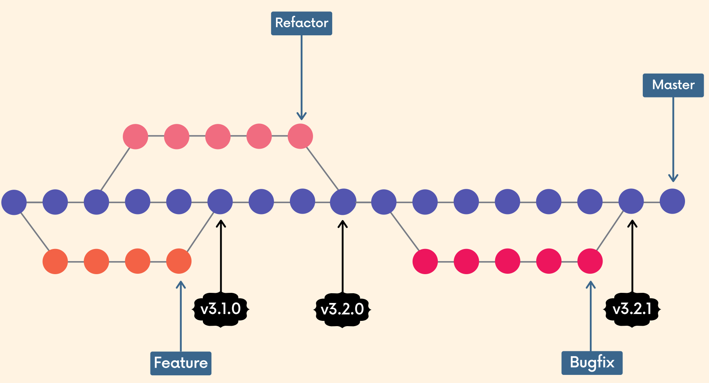
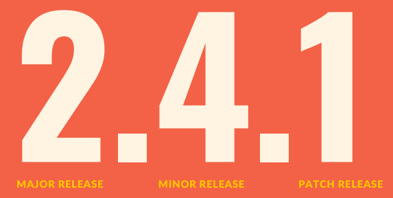
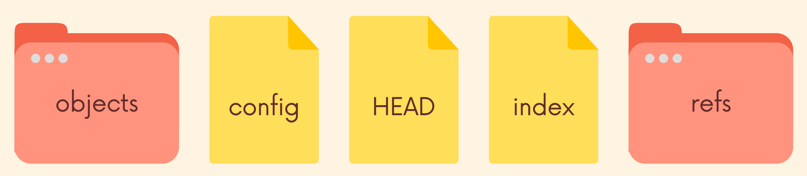
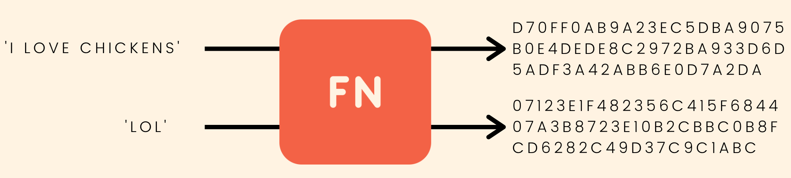
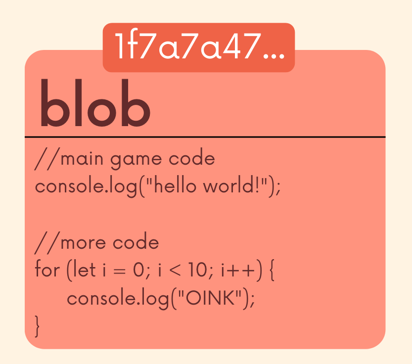
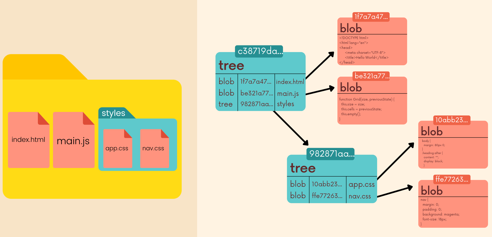
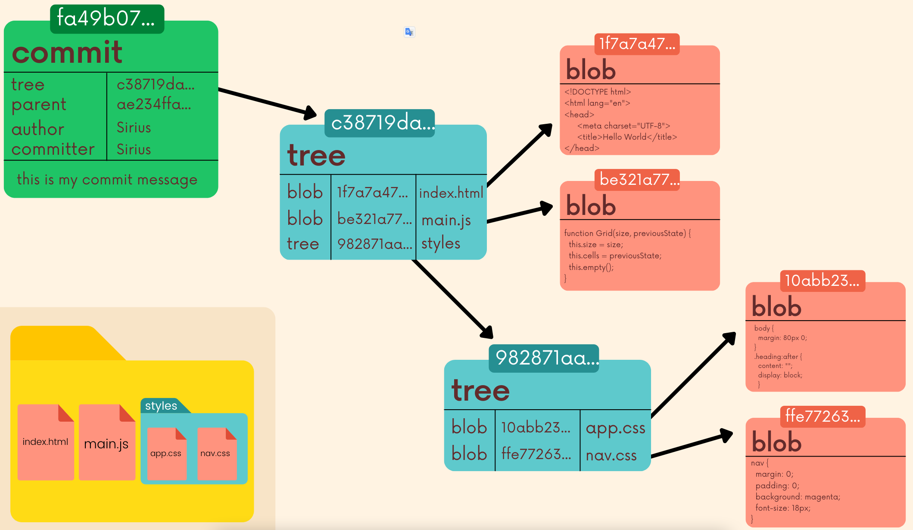

# Git Bootcamp from Udemy

[toc]

## Basics

| CMD                                                          | Note                                                         |
| :----------------------------------------------------------- | ------------------------------------------------------------ |
| `git --version`                                              | Display current git version                                  |
| `git config --global --edit`                                 | Open git global config file and then you can edit it         |
| `git config --global user.name "San Zhang"`                  | Change global user name                                      |
| `git config --global user.email abc@gmail.com`               | Change global user email                                     |
| `git status`                                                 | Gives info on the current status of a git repo and its contents |
| `git init`                                                   | To create a new git repo                                     |
| `git add file1 file2`                                        | To stage changes to be committed                             |
| `git add .`                                                  | To stage all changes at once                                 |
| `git commit -m "some message"`                               | To commit changes from staging area                          |
| `git commit -a -m "some message"` or `git commit -am "some message"` | Combine last two cmds                                        |
| `git commit --amend`                                         | To modify the last commit                                    |
| `git log --oneline`                                          | Check different commits and display them briefly one line for each commit |

## Branching

| CMD                             | Note                                                         |
| :------------------------------ | ------------------------------------------------------------ |
| `git branch`                    | To view your existing branches                               |
| `git branch -v`                 | To view your existing branches with more details (Last commit) |
| `git branch <branch-name>`      | To make a new branch based upon the current HEAD             |
| `git branch -d <branch-name>`   | To delete a branch                                           |
| `git branch -D <branch-name>`   | To force delete a branch                                     |
| `git branch -m <new-name>`      | To change the current branch to a new name                   |
| `git switch <branch-name>`      | To switch branch                                             |
| `git switch -c <branch-name>`   | To create a new branch and switch to it                      |
| `git checkout <branch-name>`    | To switch branch                                             |
| `git checkout -b <branch-name>` | To create a new branch and switch to it                      |
| `git merge <branch-name>`       | Fast-forward merge (master no change), merge the branch to the master branch |
| `git merge <branch-name>`       | None-fast-forward merge when some is appended on the master branch after creating the branch. There will be a new commit. |
|                                 |                                                              |
|                                 |                                                              |
|                                 |                                                              |


Whenever you encounter merge conflicts, follow these steps to resolve them:

1. Open up the file(s) with merge conflicts
2. Edit the file(s) to remove the conflicts. Decide which branch's content you want to keep in each conflict. Or keep the content from both. 
3. Remove the conflict "markers" in the document
4. Add your changes and then make a commit

## git diff

**To view changes between commits, branches, files, our working directory, etc.** 

It is used alongside commands like git status and git log, to get a better picture of a repository and how it has changed over time. 

| CMD                                                          | Note                                                         |
| :----------------------------------------------------------- | ------------------------------------------------------------ |
| `git diff <file>`                                            | List all the changes in working directory that are not staged for the next commit |
| `git diff HEAD <file>`                                       | List all changes in the working directory tree since your last commit |
| `git diff --staged <file>` or `git diff --cached <file>`     | List the changes between the staging area and our last commit |
| `git diff <branch-1> <branch-2>`or `git diff <branch-1>..<branch-2>` | List the chanegs between the tips of branch1 and branch2     |
| `git diff <commit-hash-1> <commit-hash-2>`or `git diff <commit-hash-1>..<commit-hash-2>` | List the changes between two different commits               |
|                                                              |                                                              |
|                                                              |                                                              |

## git stash

When working on a new branch, you made some changes but haven't make any commits. Now you need to switch back to master/other branches, two case could happen:

+ the changes come with me to the destination branch
+ git won't let me switch if it detects potential conflicts (where `git stash` could be used)

**Git pit provides an easy way of stashing these uncommitted changes so that we can return to them later, without having to maker unnecessary commits.** 

| CMD                                | Note                                                         |
| :--------------------------------- | ------------------------------------------------------------ |
| `git stash`                        | Save changes that you are not yet ready to commit            |
| `git stash pop`                    | Remove the most recently stashed changes in your stash and re-apply them to your working copy |
| `git stash apply`                  | Apply whatever is stashed away, without removing it from the stash. This can be useful if you want to apply stashed changes to multiple branches |
| `git stash list`                   | View all stashes                                             |
| `git stash apply stash@{stash-id}` | (git assumes you want to apply the most recent stash when you run `git stash apply`) You can specify a particular `stash-id` to apply |
| `git stash drop stash@{stash-id}`  | Delete a particular stash                                    |
| `git stash clear`                  | Clear out all stahses                                        |

## Time Traveling

### git checkout

`checkout` command can be used to create branches, switch to new branches, restore files, and undo history. 

Note: 

+ HEAD usually refers to a branch NOT a specific commit
+ When we checkout a particular commit, HEAD points at that commit rather than at the branch pointer (**DETACHED HEAD**). Then you have a couple options:
  + Stay in detached HEAD to examine the contents of the old commit. 
  + Leave and go back to wherever you were before: reattach the HEAD
  + Create a new branch and switch to it. You can now make and save changes, since HEAD is no longer detached.

`git checkout` supports a slightly odd syntax for referencing previous commits relative to a particular commit.

+ `HEAD~1` refers to the commit before `HEAD` (parent) 
+ `HEAD~2` refers to 2 commits before `HEAD` (grandparent) 
+ ...

| CMD                                                    | Note                                                         |
| ------------------------------------------------------ | ------------------------------------------------------------ |
| `git checkout <commit-hash>`                           | View a previous commit                                       |
| `git switch <branch-name>`                             | Re-attach HEAD: simply switch back to whatever branch you were on before |
| `git switch -`                                         | Take you back to where you left off                          |
| `git checkout HEAD <file>` or `git checkout -- <file>` | Revert the file back to whatever it looked like in last commit (to the HEAD), discard the chanegs |

### git restore

`git restore` is a brand new Git command that helps with **undoing operations**.
Because it is so new, most of the existing Git tutorials and books do not mention it, but it is worth knowing!
Recall that git checkout does a million different things, which many git users find very confusing. `git restore` was introduced alongside `git switch` as alternatives to some of the uses for checkout.

| CMD                                         | Note                                                    |
| ------------------------------------------- | ------------------------------------------------------- |
| `git restore <file>`                        | Restore the file to the contents in the HEAD            |
| `git restore --source <commit-hash> <file>` | Restore the file to the contents in a particular commit |
| `git restore --staged <file>`               | Remove unwanted file(s) in current staged file(s)       |

### git reset

Suppose you've just made a couple of commits on the master branch, but you actually meant to make them on a separate branch instead. To undo those commits, you can use `git reset`. 

| CMD                              | Note                                                         |
| -------------------------------- | ------------------------------------------------------------ |
| `git reset <commit-hash>`        | Reset the repo back to a specific commit. The commits are gone. |
| `git reset --hard <commit-hash>` | Undo both the commits AND the actual changes in your files   |

### git revert

`git revert` is similar to `git reset` in that they both "undo" changes, but they accomplish it in different ways. 

`git reset` actually moves the branch pointer backwards, eliminating commits. 

`git revert` instead creates a brand new commit which reverses/undos the changes from a commit.  Because it results in a new commit, you will be prompted to enter a commit message.

Both `git reset` and `git revert` help us reverse changes, but there is a significant difference when it comes to collaboration:

+ If you want to reverse some commits that other people already have on their machines, you should use revert.
+ If you want to reverse commits that you haven't shared with others, use reset and no one will ever know!

## Remote Tracking Branches


`master`: A regular branch reference. I can move this around myself.

`origin/master`: This is a "Remote Tracking Branch". It's a reference to the state of the master branch on the remote. I can't move this myself. It's like a bookmark pointing to the last known commit on the master branch on origin. At the time you last communicated with this remote repository, here is where x branch was pointing.

They follow this pattern `<remote>/<branch>`. 

+ `origin/master` references the state of the master branch on the remote repo named origin. 
+ `upstream/logoRedesign` references the state of the logoRedesign branch on the remote named upstream (a common remote name)

| CMD                                                          | Note                                                         |
| ------------------------------------------------------------ | ------------------------------------------------------------ |
| `git branch -r`                                              | View the remote branches our local repository knows about    |
| `git checkout origin/master`                                 | Checkout these remote branch pointers                        |
| `git switch <remote-branch-name>`<br />or <br />`git checkout --track origin/remote-branch-name` | Create a new local branch from the remote branch of the same name |

### Fetching

Fetching allows us to download changes from a remote repository, BUT those changes will not be automatically integrated into our working files. 

It lets you see what others have been working on, without having to merge those changes into your local repo.

Think of it as "please go and get the latest information from Github, but don't screw up my working directory."


| CMD                           | Note                                                         |
| ----------------------------- | ------------------------------------------------------------ |
| `git fetch <remote> <branch>` | Fetch branches and history from a specific remote repository. It only updates remote tracking branches |
| `git fetch origin`            | Fetch all changes from the origin remote repository          |

### Pulling

`git pull` is another command we can use to retrieve changes from a remote repository. Unlike fetch, pull actually updates our HEAD branch with whatever changes are retrieved from the remote.
"go and download data from Github AND immediately update my local repo with those changes"

| CMD                          | Note                      |
| ---------------------------- | ------------------------- |
| `git pull <remote> <branch>` | `git fetch` + `git merge` |

## Rebasing

There are two main ways to use the **git rebase** command:

+ as an alternative to merging
+ as a cleanup tool

Merge vs. Rebase

The feature branch has a bunch of merge commits. If the master branch is very active, my feature branch's history is muddied


We can instead rebase the feature branch onto the master branch. This moves the entire feature branch so that it BEGINS at the tip of the master branch. All of the work is still there, but we have re-written history.
Instead of using a merge commit, rebasing rewrites history by creating new commits for each of the original feature branch commits.

We can also wait until we are done with a feature and then rebase the feature branch onto the master branch.

```shell
git switch feature
git rebase master
```

### Interactive Rebase

Sometimes we want to rewrite, delete, rename, or even reorder commits (before sharing them). We can do this using interactive git rebase.

Running git rebase with the `-i` option will enter the interactive mode, which allows us to edit commits, add files, drop commits, etc. Note that we need to specify how far back we want to rewrite commits. Also, notice that we are not rebasing onto another branch.  Instead, we are rebasing a series of commits onto the `HEAD` they currently are based on.

Functions:

+ **pick** - use the commit
+ **reword** - use the commit, but edit the commit message
+ **edit** - use commit, but stop for amending
+ **fixup** - use commit contents but meld it into previous commit and discard the commit message
+ **drop** - remove commit

| CMD                    | Note                                                 |
| :--------------------- | ---------------------------------------------------- |
| `git rebase -i HEAD~n` | Interactive rebase, with `n` commits before the HEAD |

## Interact with remote repo

| CMD                                                | Note                                                         |
| :------------------------------------------------- | ------------------------------------------------------------ |
| `git remote -v`                                    | View any existing remotes for you repository                 |
| `git remote add <name> <url>`                      | Add a new remote. Name is typically `origin`                 |
| `git remote rename <old> <new>`                    | Rename a remote                                              |
| `git remote remove <name>`                         | Remove a remote                                              |
| `git push <remote> <local-branch>`                 | Make a push to a local branch up to a remote branch of the same name |
| `git push <remote> <local-branch>:<remote-branch>` | Make a push to a local branch up to a remote branch of the different name |
| `git push -u`                                      | The `-u` option allows us to set the upstream of the branch we're pushing<br />Running `git push -u origin master` sets the upsteam of the local master branch so that it tracks the master branch on the origin repo, then next time we only need to do `git push` |
|                                                    |                                                              |

## Tags

Tags are pointers that refer to particular points in Git history. We can mark a particular moment in time with a tag. Tags are most often used to mark version releases in projects (*v4.1.0*, *v4.1.1*, etc.)

Think of tags as branch references that do NOT CHANGE. Once a tag is created, it always refers to the same commit. **It's just a label for a commit.**



There are two types of Git tags we can use: 

+ **lightweight tags**: just a name/label that points to a particular commit
+ **annotated tags**: store extra meta data including the author's name and email, the date, and a tagging message (like a commit message)

> **Semantic Versioning**:
>
> The semantic versioning spec outlines a standardized versioning system for software releases. It provides a consistent way for developers to give meaning to their software releases (how big of a change is this release ??) Versions consist of three numbers separated by periods.
>
> 
>
> + **Patch releases**: normally do not contain new features or significant changes. They typically signify bug fixes and other changes that do not impact how the code is used
> + **Minor releases**: signify that new features or functionality have been added, but the project is still backwards compatible. No breaking changes. The new functionality is optional and should not force users to rewrite their own is code.
> + **Major releases**: signify significant changes that is no longer backwards compatible. Features may be removed or changed substantially.

| CMD                          | Note                                                         |
| :--------------------------- | ------------------------------------------------------------ |
| `git tag`                    | Print a list of all the tags in the current repository       |
| `git tag -l "*beta*"`        | Search for tags that match a particular wildcard pattern. <br />For example, The one on the left will print a list of tags that include "beta" in their name. |
| `git checkout <tag>`         | View the state of a repo at a particular tag                 |
| `git diff <tag1> <tag2>`     | Check out the difference between two tages/versions          |
| `git tag <tagname>`          | To create a **lightweight** tag, <br />By default, Git will create the tag referring to the commit that HEAD is referencing. |
| `git tag -a <tagname>`       | To create a **annotated** tag<br />Similar to git commit, we can also use the `-m` option to pass a message directly and forgo the opening of the text editor |
| `git show <tagname>`         | See more information about a particular tag                  |
| `git tag <tagname> <commit>` | Tag an older commit by providing the cimmit hash             |
| `git tag -f <tagname>`       | Force to change the exisiting `<tagname>` to a new commit    |
| `git tag -d <tagname>`       | Delete a existing tag                                        |
| `git push --tags`            | Transfer all of your tags to the remote server that are not already there.<br />By default, the `git push` command doesnt transfer tags to remote servers. |
| `git push <tagname>`         | To push one tag                                              |

## What is in .git?



**Note**: There's more, but this is the juicy stuff

### config

The config file is for configuration. We've seen how to configure global settings like our name and email across all Git repos, but we can also configure things on a per-repo basis.

[Reference link: git-config](https://git-scm.com/docs/git-config)

### refs Folder

+ Inside of refs, you'll find a **heads** directory. `refs/heads` contains one file per branch in a repository. Each file is named after a branch and contains the **hash of the commit** at the tip of the branch. E.g. `refs /heads/master` contains the commit hash of the last commit on the master branch. 
+ Refs also contains a `refs/tags` folder which contains one file for each tag in the repo.
+ Refs also contains a `refs/remotes` folder which contains different remotes have been set up.

### HEAD File

HEAD is just a text file that keeps track of where HEAD points.

+ If it contains `refs/heads/master`, this means that HEAD is pointing to the master branch.
+ In detached HEAD, the HEAD file contains a commit hash instead of a branch reference.

### objects Folder

The objects directory contains all the repo files. This is where Git stores the backups of files, the commits in a repo, and more. The files are all compressed and encrypted, so they won't look like much!

> **Hashing Functions**
>
> Hashing functions are functions that map input data of some arbitrary size to fixed-size output values.
>
> 
>
> **Cryptographic Hash Function**
>
> + One-way function which is infeasible to invert
> + Small change in input yields large change in the output
> + Deterministic: same input yields same output
> + Unlikely to find 2 outputs with same value

Git is a **key-value data store**. We can insert any kind of content into a Git repository, and cit will hand us back a unique key we can later use to retrieve that content. These keys that we get back are SHA-1 checksums.

Git uses a hashing function called **SHA-1** (though this is set to change eventually).Git uses SHA-1 to hash our files, directories, and commits.

+ SHA-1 always generates 40-digit hexadecimal numbers. 
+ The commit hashes we've seen a million times are the output of SHA-1

**Four types of Git objects:**

+ Git **blobs** (binary large object) are the object type Git uses to store the contents of files in a given repository. Blobs don't even include the filenames of each file or any other data. They just store the contents of a file!
  

| CMD                                        | Note                                                         |
| :----------------------------------------- | ------------------------------------------------------------ |
| `git hash-object <file>`                   | Takes some data, stores in in our .git/objects directory and gives us back the unique SHA-1 hash that refers to that data object.<br />In the simplest form (show on the left), Git simply takes some content and returns the unique key that WOULD be used to store our object. But it does not actually store anything. |
| `echo "hello" | git hash-object --stdin`   | The `--stdin` option tells `git hash-object` to use the content from stdin rather than a file. In the example, it will hash the word "hello" |
| `echo "hello" |git hash-object --stdin -w` | Rather than simply outputting the key that git would store our object under, we can use the `-w` option to tell git to actually write the object to the database. <br />After running this command, check out the contents of **.git/objects** |
| `git cat-file -p <object-hash>`            | Retrieve the stored data in .git/objects database. <br />The `-p` option tells Git to pretty print the contents of the object based on its type |
| `git cat-file -t <object-hash>`            | Tell the type of this hash object                            |

+ **Trees** are Git objects used to store the contents of al directory. Each tree contains pointers that can refer to blobs and to other trees.
  Each entry in a tree contains the SHA-1 hash of a blob or tree, as well as the mode, type, and filename.
  

| CMD                             | Note                                                         |
| :------------------------------ | ------------------------------------------------------------ |
| `git cat-file -p master^{tree}` | Print out the tree object that is pointed to by the tip of our master branch |

+ **Commit** objects combine a tree object along with information about the context that led to the current tree. Commits store a reference to parent commit(s), the author, the commiter and of course the commit message!
  

+ **Annotated tag**